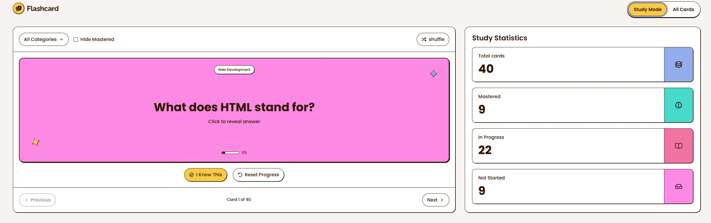

# Frontend Mentor - Flashcard app solution

This is a solution to the [Flashcard app challenge on Frontend Mentor](https://www.frontendmentor.io/challenges/flashcard-app). Frontend Mentor challenges help you improve your coding skills by building realistic projects.

## Table of contents

- [Overview](#overview)
  - [The challenge](#the-challenge)
  - [Screenshot](#screenshot)
  - [Links](#links)
- [Project structure](#project-structure)
- [Getting started](#getting-started)
  - [Prerequisites](#prerequisites)
  - [Environment variables](#environment-variables)
  - [Run locally](#run-locally)
- [Built with](#built-with)
- [Author](#author)

## Overview

### The challenge

Users should be able to:

#### Flashcard Management

- Create new flashcards with a question, answer, and category
- Edit existing flashcards to update their details
- Delete flashcards they no longer need
- See form validation messages when trying to submit a card without all fields completed
- View all their flashcards in a grid layout
- See flashcard details including question, answer, category, and mastery progress

#### Study Mode

- Study flashcards one at a time in Study Mode
- Click on a flashcard to reveal the answer
- Mark a flashcard as known by clicking "I Know This" to track mastery progress
- Navigate between flashcards using Previous and Next buttons
- See which card they're currently viewing (e.g., "Card 1 of 40")
- Track mastery progress for each card on a scale of 0 to 5
- Reset progress on a flashcard to start learning again

#### Filtering & Organization

- Filter flashcards by selecting one or multiple categories
- See the number of cards in each category within the filter dropdown
- Hide mastered cards to focus on cards that still need practice
- Shuffle flashcards to randomize the study order

#### Statistics & Progress

- View study statistics showing total cards, mastered, in progress, and not started counts

#### UI & Navigation

- Toggle between Study Mode and All Cards views
- Load more flashcards when viewing the full card list with more than 12 cards
- See a toast message when a card is created, updated, or deleted
- View the optimal layout for the interface depending on their device's screen size
- See hover and focus states for all interactive elements on the page
- Navigate the entire app using only their keyboard

### Screenshot




### Links

- [Solution](https://www.frontendmentor.io/solutions/responsive-flashcard-app-Lv3eTkKOEP) – Frontend Mentor
- [Flashcard app challenge](https://www.frontendmentor.io/challenges/flashcard-app) – Frontend Mentor
- [Live site](https://bright-daifuku-350dd2.netlify.app/) – Netlify

## Project structure

- **`frontend/`** – React SPA (Vite, TypeScript, React Router). Study Mode, All Cards list, forms, modals, and shared UI components.
- **`backend/`** – Express API that proxies flashcard CRUD and count updates to Supabase. Optional when using Supabase from the frontend directly; useful for server-side auth or extra logic.

Routes:

- `/study-mode` – Study Mode (one card at a time, flip, “I Know This”, prev/next, filters, shuffle).
- `/all-cards` – Full card list with create/edit/delete, load more, category filter.

## Getting started

### Prerequisites

- Node.js (v18+)
- npm (or yarn/pnpm)

### Environment variables

**Frontend** (`frontend/.env`):

- `VITE_SUPABASE_URL` – Supabase project URL
- `VITE_SUPABASE_API_KEY` – Supabase anon/publishable key
- `VITE_API_BASE_URL` – (optional) Backend API base URL; defaults to `http://localhost:3001`

**Backend** (`backend/.env`):

- `SUPABASE_URL` – Supabase project URL
- `SUPABASE_API_KEY` – Supabase service or anon key
- `PORT` – (optional) Server port; defaults to `3001`

### Run locally

1. Clone the repo and open the project folder.

2. **Frontend**

   ```bash
   cd frontend
   npm install
   npm run dev
   ```

   App runs at the URL shown by Vite (e.g. `http://localhost:5173`).

3. **Backend** (if you use the Express API for flashcards)

   ```bash
   cd backend
   npm install
   npm run dev
   ```

   API runs at `http://localhost:3001` (or the port set in `PORT`). Health check: `GET /health`.

4. **Docker** (backend only)

   From the `backend` directory:

   ```bash
   docker build -t flashcard-backend .
   docker run -p 3001:3001 --env-file .env flashcard-backend
   ```

## Built with

- [React](https://reactjs.org/) 19 – UI library
- [Vite](https://vitejs.dev/) – Build tool and dev server
- [TypeScript](https://www.typescriptlang.org/) – Typing
- [React Router](https://reactrouter.com/) – Client-side routing
- [Motion](https://motion.dev/) – Animations (e.g. flashcard flip, transitions)
- [Supabase](https://supabase.com/) – Backend (auth, database)
- [Express](https://expressjs.com/) – Optional Node API for flashcard and known-count endpoints
- [Docker](https://www.docker.com/) – Containerization for the backend
- [Netlify](https://www.netlify.com/) – Frontend hosting
- CSS (custom properties, Flexbox, Grid, mobile-first layout)

## Author

- Website – [Alexandre Millet](https://alexm-portofolio.netlify.app/)
- Frontend Mentor – [@alexM421](https://www.frontendmentor.io/profile/alexM421)
